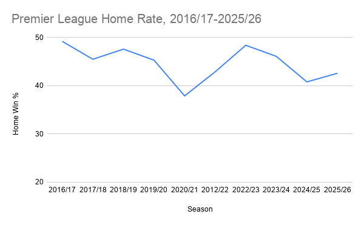
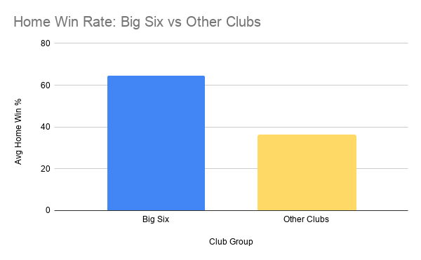

# Is Home Advantage Still a Strategic Asset? A Premier League Analysis (2016/17–2025/26)

**Business task:** Is home advantage still a strategic asset worth investing in, or has its value eroded post-pandemic — and does the answer differ by club size?

**Stakeholder:** London Athletic FC, a mid-table Premier League club deciding whether to keep investing in home-crowd-dependent strategy (ticket pricing, atmosphere, scheduling) or reallocate resources.

**Sub-questions guiding the analysis:**
- Has home-vs-away performance changed structurally since the COVID crowd-free period?
- Is any change uniform across clubs, or concentrated by club size/status?
- What should that mean for the client's investment decision?

---

## Data

Sourced from [football-data.co.uk](https://www.football-data.co.uk/), Premier League match results, 10 seasons (2016/17–2025/26) — chosen to give 4 pre-COVID seasons, the COVID crowd-free season, and 5 post-COVID seasons for comparison.

Raw files contained ~130 columns, mostly bookmaker odds data not relevant to this analysis. Reduced via SQL to the columns needed (`Date`, `HomeTeam`, `AwayTeam`, `FTHG`, `FTAG`, `FTR`, `HS`, `AS`, `HST`, `AST`) rather than manually editing the raw files, to preserve data integrity.

## Process

Each season was loaded into Google BigQuery as its own table (10 tables total), then combined into a single table using a `UNION ALL` query, adding a `Season` label to each row: see [`01_combine_seasons.sql`](01_combine_seasons.sql).

Verified data completeness by checking match counts per season — every season returned exactly 380 matches, confirming no data was lost or duplicated during the combine. Schema was also confirmed correctly typed (`Date` as DATE, goal/shot counts as INTEGER, results as STRING).

## Analysis

### 1. Home Win Rate by Season
Query: [`02_home_win_by_season.sql`](02_home_win_by_season.sql)

| Season | Home Win % |
|---|---|
| 2016/17 | 49.2% |
| 2017/18 | 45.5% |
| 2018/19 | 47.6% |
| 2019/20 | 45.3% |
| **2020/21 (COVID)** | **37.9%** |
| 2021/22 | 42.9% |
| 2022/23 | 48.4% |
| 2023/24 | 46.1% |
| 2024/25 | 40.8% |
| 2025/26 | 42.6% |

Home win rate declined from a pre-COVID range of 45.3–49.2% to 37.9% during the crowd-free 2020/21 season — the lowest point in the dataset. It has not returned to pre-COVID levels since, suggesting a longer-term structural shift rather than a COVID-only effect.

### 2. Pre/Post-COVID Comparison
Query: [`03_pre_post_covid.sql`](03_pre_post_covid.sql)

| Period | Matches | Avg. Home Win % |
|---|---|---|
| Pre-COVID | 1,520 | 46.9% |
| COVID (no crowds) | 380 | 37.9% |
| Post-COVID | 1,900 | 44.2% |

Home win rate fell 9 percentage points during COVID, recovered by 6.3 points afterward — but still sits 2.7 points below the pre-COVID baseline across nearly five full seasons, pointing toward a partial structural decline rather than a short-lived anomaly.

### 3. Home Advantage by Club Size
Query: [`04_by_club_breakdown.sql`](04_by_club_breakdown.sql)

| Club Group | Home Matches | Avg. Home Win % |
|---|---|---|
| Big Six | 1,140 | 64.4% |
| Other Clubs | 2,660 | 36.2% |

Home advantage is not uniform across the league — Big Six clubs win at home nearly twice as often as everyone else. This gap is more plausibly driven by squad quality than by crowd or venue effects, since a mid-table club cannot close it through atmosphere spend alone.

## Recommendations

**1. Deprioritise home-crowd atmosphere investment relative to other levers.**
Home advantage has weakened league-wide and remains concentrated in the Big Six for reasons unlikely to be crowd-driven. London Athletic FC should not treat atmosphere spend as a primary lever for improving results, and should instead reallocate incremental budget toward recruitment or coaching.

**2. Commission further investigation into the cause of the league-wide decline before committing to a major strategic shift.**
This analysis identifies *that* home advantage declined, not conclusively *why* — possible factors include VAR, tactical evolution, fixture congestion, or lingering pandemic effects. A follow-up analysis incorporating xG data or referee decisions would help confirm whether this is a lasting shift worth acting on.

**3. Benchmark performance against similarly-sized clubs rather than the league-wide average.**
Because home advantage is heavily skewed by the Big Six, London Athletic FC should track its own home performance against a peer group of similarly resourced clubs, not the full league average, to set realistic targets.

---

*Part of my data analyst portfolio, built using Google BigQuery (SQL) and Google Sheets, following the Ask–Prepare–Process–Analyze–Share–Act framework.*
